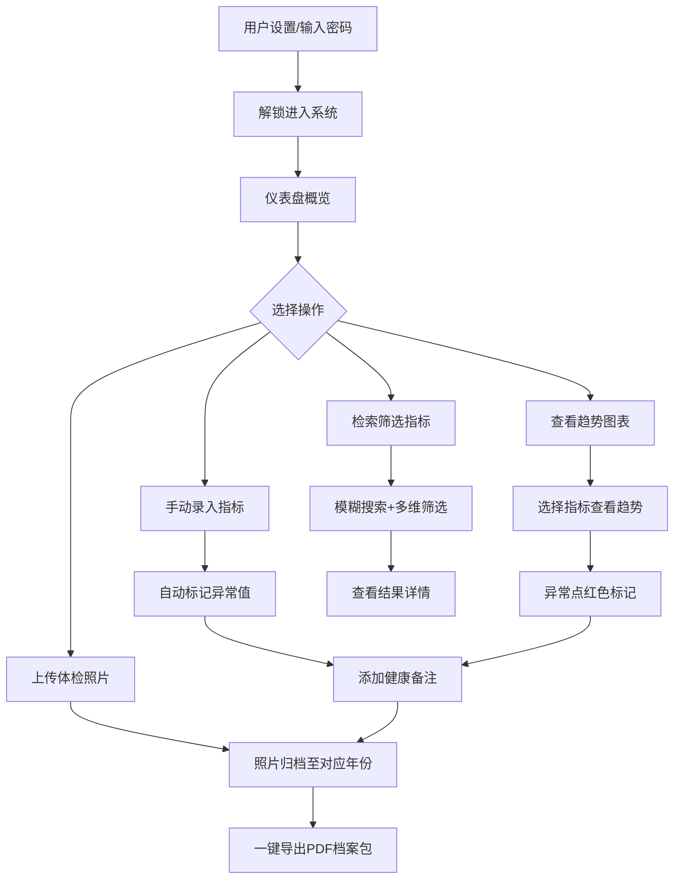

## 1. 产品概述

家庭体检报告整理归档工具是一款纯前端医疗健康管理应用，帮助家庭用户集中管理历年体检数据、追踪健康指标趋势、标记异常值并生成PDF档案包。采用干净浅蓝医疗风界面设计，所有数据本地加密存储，保障隐私安全。

- 目标用户：关注家庭健康的普通用户，需长期追踪体检指标变化趋势
- 核心价值：将分散的纸质体检报告数字化归档，通过趋势图表直观呈现健康变化，异常值即时提醒

## 2. 核心功能

### 2.1 用户角色

| 角色 | 注册方式 | 核心权限 |
|------|----------|----------|
| 家庭用户 | 本地设置密码 | 全部功能（上传、录入、导出、检索） |

### 2.2 功能模块

1. **仪表盘页面**：健康概览、最近体检摘要、异常指标提醒、快捷操作入口
2. **体检档案页面**：按年份分类归档、批量上传体检单照片、手动录入指标数值
3. **指标趋势页面**：折线图展示指标变化趋势、异常值标记、健康备注添加
4. **检索筛选页面**：指标快速搜索、多维筛选、结果高亮

### 2.3 页面详情

| 页面名称 | 模块名称 | 功能描述 |
|----------|----------|----------|
| 仪表盘 | 健康概览卡片 | 展示最近体检日期、异常指标数量、已归档年份数 |
| 仪表盘 | 异常指标提醒 | 列出最近异常指标及其备注，点击可跳转详情 |
| 仪表盘 | 快捷操作 | 快速录入、上传照片、导出PDF入口按钮 |
| 体检档案 | 年份归档侧栏 | 按年份树形展示归档列表，支持增删年份分类 |
| 体检档案 | 照片上传区 | 拖拽或点击批量上传体检单照片，缩略图预览 |
| 体检档案 | 指标录入表单 | 分类录入体检指标（血常规、肝功能、肾功能等），支持异常值标记 |
| 指标趋势 | 指标选择器 | 搜索选择需查看的体检指标 |
| 指标趋势 | 折线图 | 展示选中指标历年变化趋势，异常点红色标记 |
| 指标趋势 | 健康备注 | 对任意数据点添加/编辑健康备注 |
| 检索筛选 | 搜索栏 | 支持指标名称模糊搜索 |
| 检索筛选 | 筛选面板 | 按年份、指标分类、异常状态等多维筛选 |
| 检索筛选 | 结果列表 | 筛选结果表格展示，支持排序和分页 |

## 3. 核心流程

用户首次使用时设置本地加密密码，之后通过密码解锁进入系统。主流程为：上传体检照片 → 手动录入指标数值 → 系统自动标记异常 → 查看趋势图 → 添加健康备注 → 按年份归档 → 一键导出PDF档案包。

## 4. 用户界面设计

### 4.1 设计风格

- 主色调：浅蓝（#E8F4FD / #B3D9F2）、纯白（#FFFFFF）、浅灰（#F5F7FA）
- 强调色：医疗蓝（#4A90D9）、异常红（#E74C3C）
- 按钮风格：圆角（8px），浅蓝主按钮带柔和阴影
- 字体：系统字体栈，标题加粗，正文常规
- 布局风格：左侧导航 + 右侧内容区，卡片式内容模块
- 图标风格：线性图标，与Naive UI风格统一

### 4.2 页面设计概览

| 页面名称 | 模块名称 | UI元素 |
|----------|----------|--------|
| 仪表盘 | 健康概览卡片 | 浅蓝渐变背景、大字号数字、图标装饰 |
| 仪表盘 | 异常提醒列表 | 白色卡片、左侧红色竖条、悬浮微动效 |
| 仪表盘 | 快捷操作 | 圆角主按钮组、图标+文字、hover浅蓝底色 |
| 体检档案 | 年份侧栏 | 浅灰背景、选中项浅蓝高亮、折叠展开动效 |
| 体检档案 | 照片上传区 | 虚线边框拖拽区、缩略图网格、悬浮删除按钮 |
| 体检档案 | 指标录入表单 | 白色卡片内表单、分组折叠面板、异常标红输入框 |
| 指标趋势 | 折线图 | 浅蓝网格背景、蓝色趋势线、红色异常标记点 |
| 指标趋势 | 健康备注 | 气泡样式备注卡片、淡黄色背景 |
| 检索筛选 | 搜索栏 | 圆角搜索框、左侧搜索图标、实时搜索建议 |
| 检索筛选 | 结果列表 | 斑马纹表格、异常行浅红底色、分页器 |

### 4.3 响应式设计

- 桌面优先设计，最小宽度1024px
- 侧栏可折叠适配平板
- 内容区自适应宽度

### 4.4 3D场景指导

不适用
