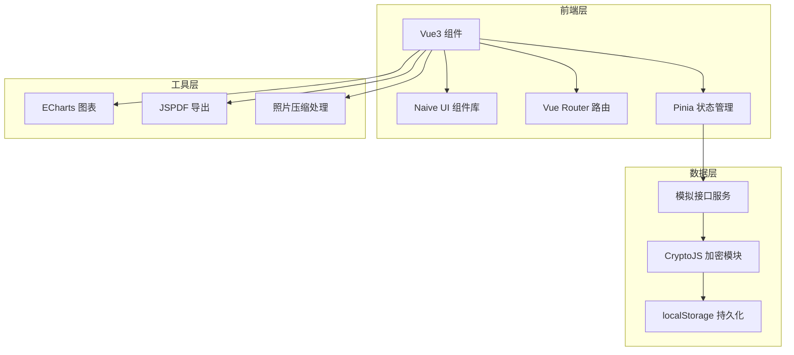
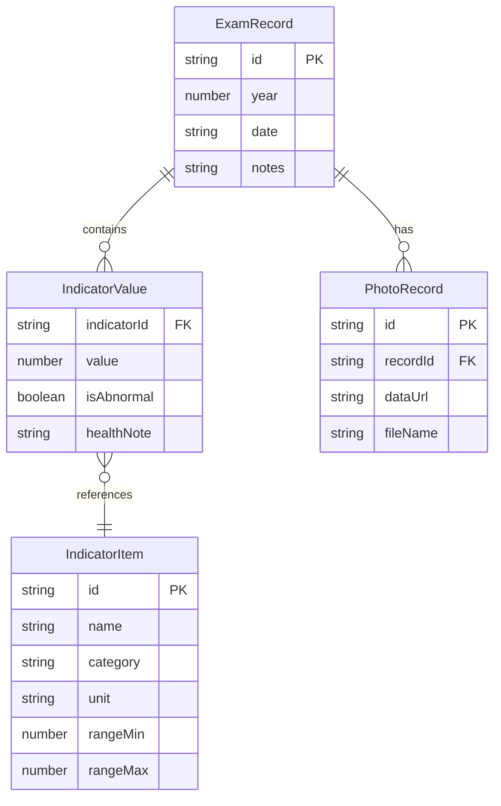

## 1. 架构设计



## 2. 技术说明

- 前端：Vue3@3 + Naive UI + Vite + TypeScript
- 初始化工具：vite-init (vue-ts 模板)
- 后端：无（纯前端应用）
- 数据库：无（使用 localStorage + CryptoJS 加密存储）
- 图表：ECharts@5（折线趋势图）
- PDF生成：jsPDF@2
- 加密：crypto-js（AES加密）
- 状态管理：Pinia

## 3. 路由定义

| 路由 | 用途 |
|------|------|
| / | 仪表盘 - 健康概览与快捷操作 |
| /archives | 体检档案 - 年份归档、照片上传、指标录入 |
| /trends | 指标趋势 - 折线图、异常标记、健康备注 |
| /search | 检索筛选 - 指标搜索与多维筛选 |

## 4. API定义（模拟接口）

### 4.1 体检指标素材加载

```typescript
interface IndicatorItem {
  id: string
  name: string
  category: string
  unit: string
  normalRange: { min: number; max: number }
  description: string
}

interface LoadIndicatorsResponse {
  code: number
  data: IndicatorItem[]
}
// GET /api/indicators — 返回预置体检指标列表
```

### 4.2 体检档案持久化

```typescript
interface ExamRecord {
  id: string
  year: number
  date: string
  photos: string[]
  indicators: IndicatorValue[]
  notes: string
}

interface IndicatorValue {
  indicatorId: string
  value: number
  isAbnormal: boolean
  healthNote: string
}

interface SaveRecordsResponse {
  code: number
  data: { success: boolean }
}

interface LoadRecordsResponse {
  code: number
  data: ExamRecord[]
}
// POST /api/records — 保存体检记录
// GET /api/records — 加载所有体检记录
// DELETE /api/records/:id — 删除体检记录
```

### 4.3 PDF导出

```typescript
interface ExportPdfResponse {
  code: number
  data: { url: string; filename: string }
}
// POST /api/export-pdf — 生成PDF档案包
```

## 5. 服务器架构图

不适用（纯前端应用）

## 6. 数据模型

### 6.1 数据模型定义



### 6.2 数据定义语言

使用 localStorage 的 JSON 序列化存储，结构如下：

- `health_records_encrypted`：AES加密后的体检记录数据
- `health_indicators`：预置体检指标列表（明文缓存）
- `health_auth_hash`：用户密码哈希值
